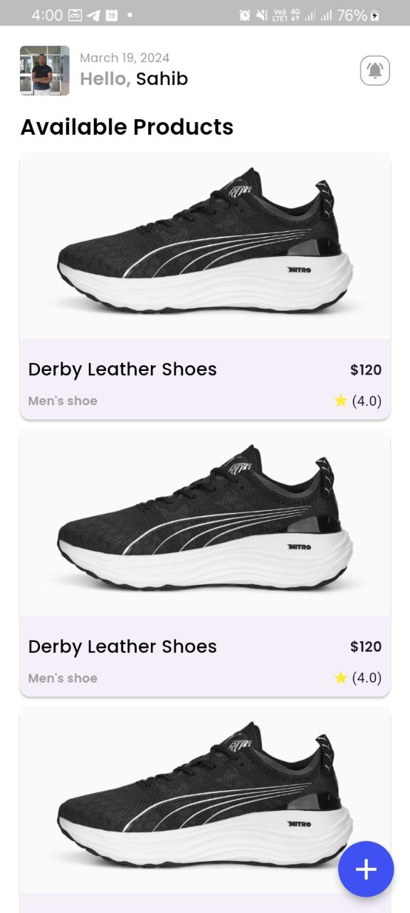
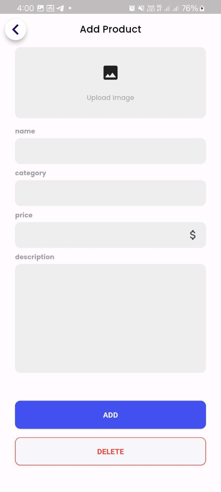
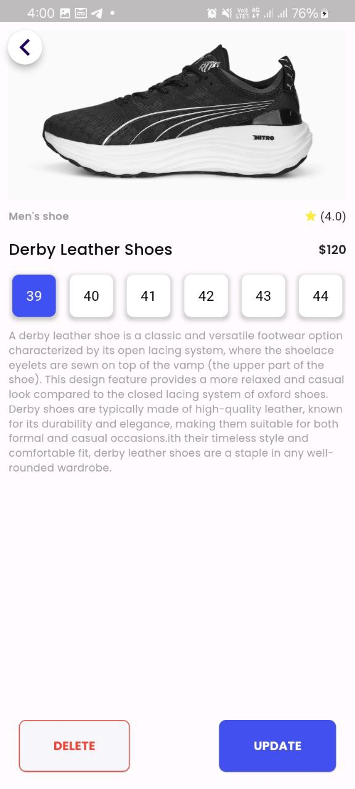

# E-Commerce Flutter App

This is a simple e-commerce app built with Flutter. It includes three main pages:

## Home Page

The home page displays a list of products 

## Add Product Page

The add product page allows users to add new product 

## Product Detail Page

The product detail page shows the details of a specific product, including images, description and price

## Features
- **Home Page:** Browse featured products
- **Add Product Page:** Add new products to the store.
- **Product Detail Page:** View detailed information about a product.

## Setup
1. Clone the repository.
2. Run `flutter pub get` to install dependencies.
3. Run the app on a simulator or device using `flutter run`.

## Contributing
Pull requests are welcome. For major changes, please open an issue first to discuss what you would like to change.

## License
[MIT](LICENSE)

